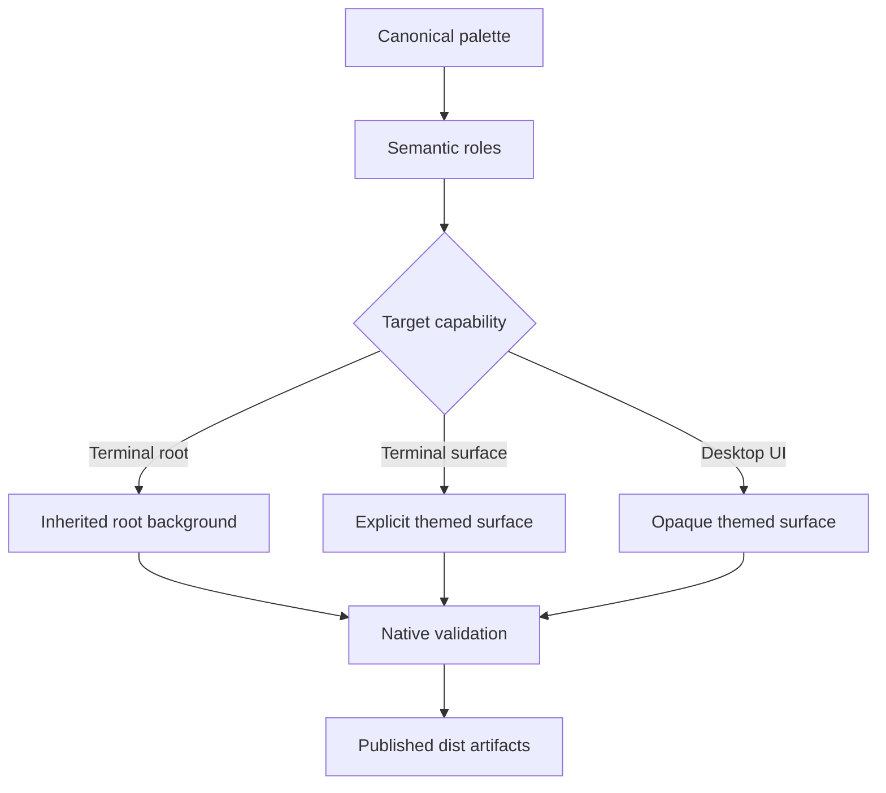
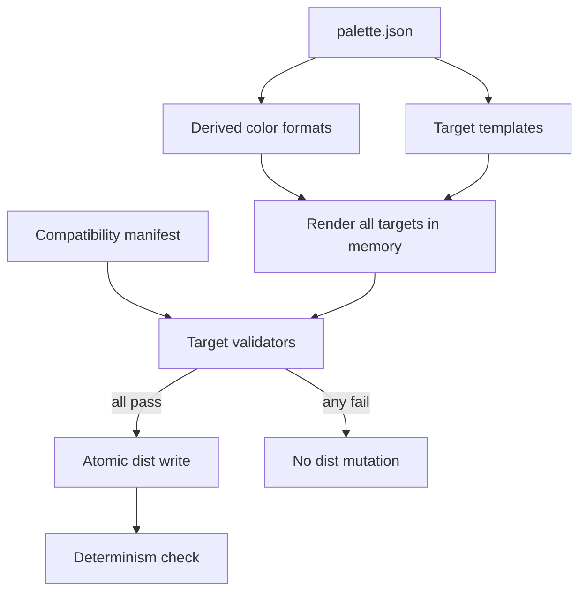
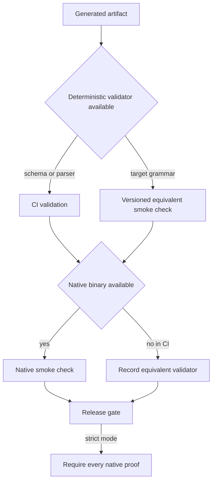

# Semantic Theme Contract - Plan

## Goal Capsule

- **Objective:** Quien use Static Noise obtiene una identidad visual coherente, legible con la transparencia habitual de la terminal y válida en cada herramienta publicada.
- **Means:** Definir un contrato semántico común y adaptar cada salida a las capacidades reales de su herramienta.
- **Product authority:** `palette.json` conserva la autoridad cromática; este Product Contract gobierna la semántica, composición y calidad de las salidas derivadas.
- **Open blockers:** Ninguno.

---

## Product Contract

### Summary

Static Noise aplicará su contrato visual mediante un compilador transaccional, representaciones de color derivadas de `palette.json`, mappings por capacidad y validadores versionados por target. La implementación cubrirá todos los artefactos publicados, conservará sus rutas y combinará comprobaciones deterministas en CI con smoke checks nativos antes del release.

### Problem Frame

La paleta es canónica, pero los artefactos no tienen hoy un contrato compartido que garantice cómo se aplican sus colores. Eso permite que un target sea visualmente coherente y otro use una jerarquía distinta, declare opciones ignoradas o incluso genere configuración inválida.

La transparencia de Ghostty está configurada al 90%. Sobre el fondo canónico opaco, `borderFocus` ofrece aproximadamente 1.97:1 contra `void`; al componer ese fondo con el escritorio, la visibilidad puede degradarse aún más. Al mismo tiempo, pintar todos los fondos raíz con colores explícitos reduce la transparencia y crea bloques opacos dentro de la terminal.

El escaneo también confirmó fallos no estéticos: la salida actual de nvim no carga como Lua, Fish recibe colores hexadecimales con un formato que no acepta, LazyGit contiene campos que no forman parte de su configuración efectiva y la validación automatizada solo cubre VS Code.

### Key Decisions

- **Contrato semántico compartido.** (session-settled: user-directed — chosen over correcciones puntuales y perfiles opaco/transparente: un contrato común evita que las divergencias reaparezcan). Governs R1–R12.
- **`borderStrong` será un rol estructural propio.** (session-settled: user-directed — chosen over reutilizar `text.dim` o cambiar globalmente `borderFocus`: los bordes necesitan mayor contraste sin mezclar responsabilidades semánticas). Governs R2, R4, R5.
- **Los bordes estructurales usarán la dirección neutral fuerte.** (session-settled: user-directed — chosen over un refuerzo mínimo o una jerarquía dual: la legibilidad bajo transparencia es la prioridad). Governs R4, R10.
- **La composición de terminal será híbrida.** (session-settled: user-directed — chosen over fondos totalmente explícitos o totalmente heredados: el fondo raíz y los viewports que alojan aplicaciones deben conservar transparencia; las superficies internas delimitadas deben conservar profundidad cuando la herramienta pueda pintarlas sin opacar el lienzo completo). Governs R3, R6, R10.
- **La revisión cubre armonía e integridad completa.** (session-settled: user-directed — chosen over una revisión solo visual o limitada a errores críticos: un tema completo debe cargar y producir efectos reales). Governs R7–R12.

### Requirements

**Semantic authority**

- R1. Todo color concreto debe originarse en `palette.json`; ninguna plantilla o consumidor generado puede introducir colores locales.
- R2. La paleta debe expresar roles distintos para borde sutil, borde estructural y foco. `borderStrong` será el token canónico de borde estructural; el foco usará el cyan canónico. El token heredado `colors.base.borderFocus` se retirará después de migrar sus consumidores y documentar el cambio.
- R3. El contrato debe definir de forma común los roles de fondo raíz, superficie, overlay, borde, foco, selección, texto y estados semánticos.
- R4. Los límites estructurales activos e inactivos deben usar `borderStrong`; cyan queda reservado para el indicador de foco o interacción activa, no para la estructura permanente.

**Transparency and hierarchy**

- R5. Un borde estructural debe alcanzar al menos 3:1 contra `void` opaco y contra el fondo raíz efectivo al componer `void` al 90% sobre fixtures negro, gris medio y blanco. La comprobación compuesta complementa, no sustituye, el cálculo opaco.
- R6. Los targets ejecutados dentro de Ghostty deben heredar el fondo raíz cuando la herramienta lo permita. En multiplexores, cada viewport de pane que aloja una aplicación cuenta como fondo raíz heredado. Barras, pestañas y overlays delimitados deben usar superficies explícitas cuando puedan hacerlo sin opacar el lienzo completo; si una herramienta no ofrece fondos por componente, debe conservar el fondo heredado y expresar profundidad mediante `borderStrong` y tokens de texto.
- R7. Los targets fuera de la terminal deben conservar fondos opacos y aplicar la misma jerarquía semántica sin simular transparencia.

**Target capability and integrity**

- R8. Cada target debe emitir únicamente opciones reconocidas por su formato y por la versión exacta registrada en la matriz de compatibilidad. Antes de modificar plantillas, la implementación debe fijar esa matriz a la versión estable más reciente disponible para cada herramienta y mantenerla versionada junto con sus validadores.
- R9. Cada artefacto generado debe ser sintácticamente válido y poder cargarse mediante el verificador nativo de la versión registrada, un esquema oficial o, cuando el binario no esté disponible en CI, un smoke check equivalente identificado explícitamente en la matriz.
- R10. Selección, búsqueda, diff, advertencia, error, éxito y foco deben mantener la misma intención entre herramientas comparables. Un pane inactivo vuelve a `borderStrong`; una selección sin foco conserva el fondo neutral de selección y no el indicador cyan de foco.
- R11. Cada artefacto auxiliar debe ser cargable directamente o estar documentado como fragmento de integración. La configuración completa de Starship debe incorporar y seleccionar la paleta Static Noise; `dist/starship/static-noise-palette.toml` se conserva como fragmento modular para integrarlo en configuraciones propias, no como archivo importable en tiempo de ejecución.
- R12. Las rutas y formatos publicados deben conservarse salvo que el formato existente sea inválido, ignorado u obsoleto; cualquier cambio necesario —incluida la retirada de tokens canónicos— debe documentar su migración.

### Contract Shape

La relación es de capacidad, no de paridad literal. Un target puede omitir un rol que no soporte, pero no sustituirlo silenciosamente por una semántica distinta.

### Acceptance Examples

- AE1. **Covers R4–R6.** Con Ghostty al 90%, un pane de Zellij y el lienzo principal de una TUI dejan ver la composición de la terminal. Las barras y los overlays compatibles conservan superficies del tema; donde una superficie explícita opacaría todo el viewport, `borderStrong` y el texto mantienen la profundidad visual.
- AE2. **Covers R7, R10.** Al abrir VS Code, la interfaz permanece opaca y usa la misma distinción entre borde estructural, foco cyan, selección y estados que los targets de terminal. Al perder foco un grupo de editor, desaparece el indicador cyan pero se conserva la selección neutral.
- AE3. **Covers R8, R9.** Si falta una versión en la matriz, una plantilla genera Lua inválido, una clave no existe en la versión registrada o un color usa un formato no admitido, la verificación falla antes de publicar `dist/`.
- AE4. **Covers R10.** Un cambio añadido se representa como éxito/verde y uno eliminado como error/rojo en nvim, LazyGit, Delta y VS Code, respetando la capacidad de cada herramienta.
- AE5. **Covers R11.** `dist/starship/starship.toml` incluye y selecciona la paleta Static Noise. `dist/starship/static-noise-palette.toml` contiene el mismo bloque de paleta como fragmento documentado para incorporarlo manualmente a una configuración existente; ninguna salida afirma que Starship pueda importarlo.
- AE6. **Covers R12.** Si una herramienta abandona un formato soportado o se retira `colors.base.borderFocus`, la salida nueva mantiene la ruta pública cuando sea posible y la documentación explica la migración inevitable.

### Success Criteria

- Todos los artefactos de `dist/` pasan la validación registrada para su formato y versión soportada.
- La matriz de compatibilidad enumera cada salida respaldada por una herramienta, su versión exacta y el verificador nativo, esquema o smoke check usado en CI.
- No quedan colores concretos en `templates/` fuera de placeholders resueltos desde `palette.json`.
- Los límites estructurales cumplen 3:1 contra `void` opaco y contra las tres composiciones de referencia al 90%.
- Los lienzos raíz y los viewports de multiplexor no reciben rellenos explícitos que bloqueen la transparencia; las superficies internas solo se pintan donde la capacidad del target permite delimitarlas.
- Ninguna salida contiene campos ignorados, configuración inválida o artefactos auxiliares sin una forma de consumo documentada.
- Dos compilaciones consecutivas producen los mismos archivos.

### Scope Boundaries

- Incluye Ghostty, Zellij/zjstatus, nvim, VS Code, Fish/FZF, Starship, Bottom, LazyGit, Delta, Pi y la paleta JSON distribuida.
- Incluye cambios en tokens semánticos, mappings, composición transparente, cobertura de estados, validaciones y documentación pública.
- Excluye variantes separadas del tema para modos opaco y transparente.
- Excluye colores definidos directamente en targets o configuraciones consumidoras.
- Excluye rediseñar la identidad cromática de los acentos actuales salvo que una medición de contraste demuestre que un token no puede cumplir su rol.

### Dependencies and Assumptions

- Ghostty sigue siendo la autoridad del fondo terminal y mantiene `background-opacity = 0.90` en la configuración consumidora. Los fixtures de composición asumen el comportamiento predeterminado en el que los fondos de celda explícitos permanecen opacos; cualquier activación futura de opacidad para todas las celdas exige recalibrar las pruebas.
- Antes de cambiar plantillas se creará una matriz de compatibilidad para Ghostty, Zellij, zjstatus, nvim, VS Code, Fish, FZF, Starship, Bottom, LazyGit, Delta y Pi. La línea base de cada entrada será la versión estable más reciente disponible en la fecha de inicio de implementación; esa versión exacta y su método de validación quedarán registrados y serán la autoridad de R8–R9.
- `dist/palette.min.json` se valida como formato JSON y contrato de tokens, no como una aplicación independiente.
- Las capacidades y claves admitidas se comprobarán contra las versiones registradas y su documentación oficial, no por similitud de nombres entre herramientas.
- Si CI no dispone de un binario nativo, el smoke check sustituto debe quedar identificado en la matriz y una validación nativa equivalente debe ejecutarse antes del release.
- Los repositorios consumidores de nvim y VS Code continúan recibiendo los artefactos por las rutas publicadas actuales.

### Sources and Research

- `palette.json` — colores canónicos y jerarquía actual.
- `templates/` y `dist/` — mappings y artefactos auditados.
- `test/build.test.mjs` — cobertura automatizada actual limitada a VS Code.
- [Ghostty theme documentation](https://ghostty.org/docs/features/theme) — separación entre tema y configuración de opacidad.
- [Ghostty configuration reference](https://ghostty.org/docs/config/reference) — alcance de `background-opacity`, fondos de celda explícitos y validación de configuración.
- [Zellij themes](https://zellij.dev/documentation/themes) — modelo de componentes y tripletas RGB de Zellij 0.45.
- [Neovim Lua guide](https://neovim.io/doc/user/lua/) — carga y validación de módulos Lua en modo headless.
- [Fish `set_color` documentation](https://fishshell.com/docs/current/cmds/set_color.html) — formato hexadecimal sin `#`.
- [FZF color options](https://github.com/junegunn/fzf/blob/master/man/man1/fzf.1) — elementos de color y uso del fondo predeterminado de terminal.
- [Starship configuration](https://starship.rs/config/) — selección y definición de paletas.
- [Pi themes](https://pi.dev/docs/latest/themes) — tokens requeridos y esquema del tema para Pi 0.85.1.
- [LazyGit configuration](https://github.com/jesseduffield/lazygit/blob/master/docs/Config.md) — campos admitidos por `gui.theme`.
- [Bottom default configuration](https://github.com/ClementTsang/bottom/blob/main/sample_configs/default_config.toml) — estructura moderna de estilos.
- [Delta color styles](https://dandavison.github.io/delta/choosing-colors-styles.html) — diferencia entre estilos de línea y énfasis.

---

## Planning Contract

**Product Contract preservation:** meaning unchanged; the Summary now names the implementation approach, while R1–R12 and AE1–AE6 retain their meaning and identifiers.

### Key Technical Decisions

- KTD1. **Adopt `#6E7588` for `colors.base.borderStrong`.** This value follows the settled strong-neutral direction, reaches 4.10:1 against opaque `void`, and remains above 3:1 when `void` is composited at 90% over the black, mid-gray, and white fixtures required by R5.
- KTD2. **Derive target representations during compilation.** `palette.json` remains the only concrete color source; the compiler exposes reusable bare-hex and RGB-triplet views for formats such as Fish and Zellij instead of duplicating values or adding template literals. Governs R1, R2, and R8.
- KTD3. **Make generation transactional and testable.** A pure compiler layer renders and validates every target in memory before the CLI writes any file, so one invalid target cannot leave a partially refreshed `dist/`. Governs R8, R9, and R11.
- KTD4. **Use layered validation.** Deterministic parsers, vendored schemas, and versioned semantic allowlists run in CI; native tools add smoke coverage when present, and strict native verification is mandatory before release. This avoids both regex-only false confidence and a CI design that depends on every application binary being installable. Governs R8 and R9.
- KTD5. **Represent transparency through target-native default backgrounds.** (session-settled: user-directed — chosen over explicit root fills or a second transparent variant: root canvases inherit the host while bounded surfaces stay explicit when supported.) Neovim uses its default-background sentinel, FZF uses the terminal default, Zellij leaves application viewports untouched, and opaque desktop targets retain concrete roots. Governs R3–R7 and R10.
- KTD6. **Preserve published artifacts while making their consumption explicit.** The full Starship configuration embeds and selects its palette, the modular palette remains a documented copy-in fragment, and both are checked for identical palette content. Governs R11 and R12.

### Compatibility Baseline

`compatibility.json` will record these implementation-start baselines and the authoritative documentation or schema used by each validator. Upgrades change the manifest and validators together.

| Target | Baseline | Primary automated proof | Native smoke proof |
|---|---:|---|---|
| Node compiler | 22 | Node test runner and JSON parser | `node` |
| Ghostty | 1.3.1 | Theme key/value and color contract validator | `ghostty +validate-config` with the generated theme as an explicit config file |
| Zellij | 0.45.1 | KDL parse plus current component-theme structure | Zellij config/layout load check |
| zjstatus | 0.25.0 | Versioned option allowlist and status-format grammar | Layout load with the matching plugin release |
| Neovim | 0.12.5 | Lua parse plus highlight-shape assertions | Headless `loadfile` and module load |
| VS Code | 1.137 | JSON parse, theme shape, color-key allowlist, and color validation | Consumer extension smoke test after synchronization |
| Fish | 4.8.1 | Fish syntax check and bare-hex assertions | Non-interactive source of the generated script |
| FZF | 0.74.3 | Option and color-role grammar assertions | Filter-mode invocation with generated options |
| Starship | 1.26.0 | TOML parse, palette selection, and modular/full parity | Config load through Starship |
| Bottom | 0.14.9 | TOML parse and current `[styles]` schema | Config load through `btm` |
| LazyGit | 0.64.1 | YAML parse and documented `gui.theme` key allowlist | Effective-config load through LazyGit |
| Delta | 0.19.2 | Git-config parse and style-role assertions | `delta --show-config` against the generated file |
| Pi | 0.85.1 | JSON parse against the vendored matching theme schema | Theme discovery/load through Pi |

### High-Level Technical Design

### Sequencing

U1 establishes canonical tokens and rendering primitives. U2 builds the validation contract before target migrations, providing characterization coverage for the currently weak build. U3–U6 then migrate independent target groups against that contract. U7 integrates documentation, CI, generated outputs, and the final release gate.

### Alternatives Considered

- **Patch each broken template without a shared validator:** rejected because the current failures already demonstrate that build success does not prove target validity.
- **Require every native binary in ordinary CI:** rejected because Ghostty and desktop consumers are not uniformly available in lightweight Linux runners; strict native verification remains a release requirement instead.
- **Use regular expressions as the only format validation:** rejected because KDL, TOML, YAML, Lua, and nested tool schemas need parsers or native loaders to catch structural errors.
- **Generate separate opaque and transparent variants:** rejected by the Product Contract; capability-aware mappings provide one coherent artifact per target.

### System-Wide Impact

- Removing `colors.base.borderFocus` changes the public minified palette and both synchronized consumer artifacts; README migration notes and the next release must call out the replacement.
- Every template and generated target changes or is revalidated, so consumers may receive broad visual diffs even when their public path remains stable.
- CI gains development-only parser/schema dependencies and broader validation, while the published compiler remains free of runtime dependencies.
- VS Code and Neovim dispatch workflows retain their existing paths and trigger behavior; regenerated artifacts naturally activate synchronization on the next tag.

### Risks and Mitigations

- **Upstream format churn:** exact baselines and source links live in `compatibility.json`; upgrades must update the validator and fixture together.
- **Equivalent validator drift:** strict native verification before release catches discrepancies that deterministic CI checks miss.
- **Wallpaper-dependent contrast:** black, mid-gray, and white fixtures bound the reproducible check, while README documents that arbitrary photographic backgrounds remain outside the mathematical guarantee.
- **Public token removal:** documentation maps `borderFocus` consumers to `borderStrong` for structure or cyan for active focus before release.
- **Wide generated diff:** target migrations are grouped by capability and verified independently before the final all-target regeneration.

---

## Implementation Units

### U1. Canonical tokens and rendering primitives

- **Goal:** Establish the canonical structural color and make target-specific color representations derive from the palette without duplication.
- **Requirements:** R1, R2, R4, R5, R12; AE6.
- **Dependencies:** None.
- **Files:** `palette.json`, `src/build.js`, `src/compiler.js` (new), `test/palette.test.mjs` (new), `test/build.test.mjs`, `README.md`.
- **Approach:**
  1. Add `colors.base.borderStrong` with the KTD1 value, migrate source references, remove `colors.base.borderFocus`, and align the palette version with `package.json`.
  2. Extract rendering into a pure compiler layer that can target a temporary output directory during tests.
  3. Generate bare-hex and RGB-triplet views from canonical six-digit hex colors as specified by KTD2.
  4. Reject missing templates, unresolved placeholders, invalid palette colors, concrete template color literals, and any validation failure before writing outputs.
- **Execution note:** Add characterization and contrast tests before changing templates; the existing build only proves VS Code shape.
- **Patterns to follow:** Keep the current declarative target list and Node native file APIs; do not place target-specific semantics in `palette.json`.
- **Test scenarios:**
  1. A valid palette derives `6E7588` for bare-hex consumers and `110 117 136` for RGB-triplet consumers without changing the canonical value.
  2. `borderStrong` reaches at least 3:1 against opaque `void` and each required 90% composite fixture.
  3. A missing template, unknown placeholder, malformed hex token, or literal hex in a template fails before any file in a temporary output directory changes.
  4. Two compilations from the same inputs produce byte-identical target maps.
  5. Covers AE6. The generated palette no longer exposes `borderFocus`, and the documented migration points structural and active-focus consumers to their distinct replacements.
- **Verification:** Palette tests prove the contrast and migration contract; compiler tests prove all-or-nothing rendering and deterministic derived formats.

### U2. Versioned validation contract

- **Goal:** Give every published target a deterministic validator and an explicit native smoke path tied to a supported version.
- **Requirements:** R8, R9, R11; AE3.
- **Dependencies:** U1.
- **Files:** `compatibility.json` (new), `src/validate.js` (new), `schemas/pi-theme.schema.json` (new), `test/helpers/compile-fixture.mjs` (new), `test/validation.test.mjs` (new), `package.json`, `package-lock.json` (new), `.github/workflows/verify.yml`, `RELEASING.md`.
- **Approach:**
  1. Record the Compatibility Baseline table as machine-readable data, including source URL, validator kind, executable, and strict-native requirement.
  2. Add development-only parsers for JSON Schema, YAML, TOML, KDL, and Lua rather than introducing runtime dependencies or regex substitutes.
  3. Implement target validators as pure functions invoked by the compiler and tests; each validator checks syntax, supported keys, color encoding, and required semantic relationships.
  4. Add a native verification entry point with ordinary mode using equivalent checks when a binary is absent and strict mode failing on any missing or unsuccessful native proof.
  5. Keep CI deterministic and require the strict mode in `RELEASING.md` before tagging.
- **Execution note:** Build the validators against known-bad copies of the current Neovim, Fish, LazyGit, Bottom, Zellij, and Starship artifacts before migrating them.
- **Patterns to follow:** Extend `validateVscodeTheme` into target-specific modules rather than adding validation branches inside template rendering.
- **Test scenarios:**
  1. Covers AE3. Invalid Lua, an unsupported LazyGit key, an obsolete Bottom section, malformed KDL, and an invalid Fish color each fail with the target and reason named.
  2. Every target in the compiler has exactly one compatibility entry, and every compatibility entry resolves to an output and validator.
  3. A schema or parser rejection prevents all output writes through the transactional compiler.
  4. Ordinary native verification uses the declared equivalent validator when a binary is absent and reports that substitution.
  5. Strict native verification fails when any required executable is absent or returns a non-zero result.
  6. The vendored Pi schema matches the version and source recorded in the compatibility manifest.
- **Verification:** The test suite proves malformed fixtures cannot pass and the compatibility manifest has complete one-to-one coverage with generated artifacts.

### U3. Ghostty and Zellij host composition

- **Goal:** Make the terminal host and multiplexer preserve the transparent root while exposing structural and active focus correctly.
- **Requirements:** R3–R6, R8–R10; AE1, AE3.
- **Dependencies:** U1, U2.
- **Files:** `templates/ghostty.template`, `templates/zellij.kdl.template`, `templates/zellij-layout.kdl.template`, `test/targets/ghostty-zellij.test.mjs` (new), `dist/ghostty/static-noise`, `dist/zellij/static-noise.kdl`, `dist/zellij/layouts/default.kdl`.
- **Approach:**
  1. Map the Ghostty root to `void`, neutral selection to `selection`, and active cursor to cyan without putting opacity in the theme artifact.
  2. Replace the legacy Zellij palette shape with the 0.45 component-theme model using derived RGB triplets.
  3. Map unselected frames to `borderStrong`, selected frames to cyan, semantic exits to green/red, and selected UI components to bounded explicit surfaces.
  4. Keep application panes as untouched host viewports; restrict explicit zjstatus backgrounds to its one-line bar, tabs, and mode pills.
  5. Validate the layout options against zjstatus 0.25.0 and preserve the published plugin path.
- **Execution note:** Prefer native config/layout loading after deterministic KDL tests because visual transparency depends on host behavior.
- **Patterns to follow:** Preserve the current `themes { ... }` and `layout { ... }` publication boundaries and the consumer's Ghostty opacity setting.
- **Test scenarios:**
  1. Covers AE1. The generated Zellij layout has no full-pane background directive, while frames, tabs, and the status bar retain their intended hierarchy.
  2. The Zellij theme uses every required 0.45 component and only RGB triplets derived from `palette.json`.
  3. Inactive frames resolve to `borderStrong`; selected frames resolve to cyan; success and error components resolve to green and red.
  4. The Ghostty artifact validates with root, selection, cursor, foreground, and all ANSI slots present, with no opacity key embedded.
  5. Invalid zjstatus option names or malformed style strings are rejected before generation.
- **Verification:** Deterministic validators and native loaders accept both artifacts; a manual Ghostty-at-90% smoke confirms nested panes retain the backdrop.

### U4. Neovim, Fish, and FZF terminal applications

- **Goal:** Preserve inherited terminal canvases while keeping bounded surfaces, selection, borders, and focus legible in terminal applications.
- **Requirements:** R1–R6, R8–R10; AE1, AE3, AE4.
- **Dependencies:** U1, U2.
- **Files:** `templates/neovim.lua.template`, `templates/fish-colors.template`, `test/targets/terminal-apps.test.mjs` (new), `dist/neovim/palette.lua`, `dist/fish/static-noise-colors.fish`.
- **Approach:**
  1. Repair the Lua table syntax and replace root highlight backgrounds with Neovim's inherited-background sentinel.
  2. Keep floats, menus, active lines, status lines, and overlays explicit; use `borderStrong` for structural separators and cyan only for active focus/cursor groups.
  3. Preserve neutral unfocused selection and green/red diff intent across native and plugin highlight groups.
  4. Render bare hex for Fish `set_color` values while retaining hash-prefixed hex for FZF.
  5. Make FZF's root background inherit the terminal and keep only the active row and search states explicitly surfaced.
- **Execution note:** Start with syntax and non-interactive load tests, then perform the transparency smoke; this unit repairs a currently unloadable artifact.
- **Patterns to follow:** Keep the returned Neovim palette table and existing Fish global-variable interface stable for downstream consumers.
- **Test scenarios:**
  1. Covers AE3. The generated Lua parses and loads headlessly; removing a separator comma reproduces a failing fixture.
  2. Covers AE1. Root Neovim groups and FZF use inherited backgrounds, while floats, menus, status lines, active rows, and selections retain explicit bounded surfaces.
  3. Structural separators use `borderStrong`; cursor and active focus indicators use cyan; inactive selection remains neutral.
  4. Fish receives six-digit hex without `#`, FZF receives accepted color syntax, and the generated script passes `fish -n` and non-interactive sourcing.
  5. Covers AE4. Neovim added and removed diffs resolve to green and red families with distinct emphasis backgrounds.
- **Verification:** Parser tests, Fish/FZF native smoke checks, and a headless Neovim load all pass against generated artifacts.

### U5. VS Code and Pi opaque interface mappings

- **Goal:** Apply the shared structural, focus, selection, and state hierarchy to the two opaque/editor interfaces without weakening their existing syntax coverage.
- **Requirements:** R2–R4, R7–R10; AE2–AE4.
- **Dependencies:** U1, U2.
- **Files:** `templates/vscode.json.template`, `templates/pi-theme.json.template`, `test/targets/editor-themes.test.mjs` (new), `dist/vscode/static-noise-color-theme.json`, `dist/pi/static-noise-theme.json`.
- **Approach:**
  1. Replace structural `borderFocus` uses with `borderStrong` in VS Code, add cyan only to supported active-focus keys, and keep inactive selections neutral.
  2. Add `borderStrong` to Pi variables; map normal borders to it, muted borders to `border`, and active borders to cyan while preserving explicit message and export surfaces.
  3. Retain the existing syntax and semantic-token mappings unless a validator proves a key unsupported; this unit changes interface hierarchy, not the accent language.
- **Execution note:** Add schema and allowlist assertions before changing mappings so existing syntax coverage remains characterized.
- **Patterns to follow:** Preserve both JSON artifact shapes and the current VS Code semantic/token-color split.
- **Test scenarios:**
  1. Covers AE2. VS Code remains fully opaque, uses strong neutral structure, cyan active focus, and neutral inactive selection.
  2. The Pi theme satisfies every required schema token, resolves every variable, and distinguishes normal, muted, and active borders.
  3. Covers AE4. Both themes preserve green added/success and red removed/error intent while structural keys avoid cyan.
  4. Unknown VS Code workbench colors or missing Pi tokens fail validation before output writes.
- **Verification:** Both JSON validators and the native Pi loader accept the generated themes; the VS Code consumer smoke confirms the theme can be packaged unchanged.

### U8. Bottom and LazyGit supported TUI configuration

- **Goal:** Replace obsolete or ignored TUI configuration with version-supported mappings that inherit the terminal root and preserve active/inactive hierarchy.
- **Requirements:** R3–R6, R8–R10; AE1, AE3, AE4.
- **Dependencies:** U1, U2.
- **Files:** `templates/bottom-colors.template`, `templates/lazygit-theme.template`, `test/targets/structured-tui.test.mjs` (new), `dist/bottom/static-noise-colors.toml`, `dist/lazygit/static-noise-theme.yml`.
- **Approach:**
  1. Migrate Bottom from the obsolete `[colors]` layout to its 0.14 `[styles]` sections, leaving widget root backgrounds unset and mapping selected borders to cyan.
  2. Remove undocumented LazyGit fields and retain only 0.64-supported theme keys, with cyan active borders, neutral strong inactive borders, neutral inactive selection, and semantic change colors.
  3. Keep full-canvas backgrounds inherited; use explicit fills only for supported selected rows and ranges.
- **Execution note:** Drive the migration from negative fixtures for obsolete Bottom sections and ignored LazyGit keys before replacing the templates.
- **Patterns to follow:** Preserve each target's output path and top-level configuration ownership while adopting the exact versioned schema.
- **Test scenarios:**
  1. Bottom parses under the 0.14 schema with supported nested style keys and no explicit widget root background.
  2. Covers AE3. Each previously unsupported LazyGit key is rejected by a negative fixture and absent from the generated YAML.
  3. Active borders resolve to cyan, inactive borders to `borderStrong`, and inactive selections to the neutral selection role.
  4. Covers AE4. LazyGit preserves green staged intent and red unstaged intent using only capabilities documented for 0.64.
  5. Native Bottom and LazyGit config loads produce no unknown-key or parse diagnostics.
- **Verification:** TOML and YAML validators accept both generated artifacts, and native loaders confirm that every retained field has an effect in the supported baseline.

### U6. Starship and Delta consumable artifacts

- **Goal:** Connect the Starship palette to its full configuration and correct Delta's line-versus-emphasis semantics without changing public paths.
- **Requirements:** R1, R8–R12; AE4–AE6.
- **Dependencies:** U1, U2.
- **Files:** `templates/starship.toml.template`, `templates/starship-palette.template`, `templates/delta-theme.template`, `test/targets/prompt-diff.test.mjs` (new), `dist/starship/starship.toml`, `dist/starship/static-noise-palette.toml`, `dist/delta/static-noise.gitconfig`.
- **Approach:**
  1. Add the named palette block and palette selection to the full Starship configuration, then express module styles through palette names.
  2. Keep the standalone palette as a copy-in fragment and validate that its parsed table equals the full configuration's embedded table.
  3. Map Delta whole added/removed lines to the base diff backgrounds and emphasized spans to the emphasis variants.
  4. Validate both TOML artifacts and parse Delta through Git before invoking its effective-config smoke.
- **Patterns to follow:** Preserve the complete-config and modular-fragment split documented in README and the existing `[delta]` include shape.
- **Test scenarios:**
  1. Covers AE5. The full Starship file selects `static-noise`, defines that palette, and every named style resolves to a palette entry.
  2. The standalone and embedded Starship palette maps are identical after parsing.
  3. A removed Delta line uses `diff.removed`, removed emphasis uses `diff.removedEmphasis`, and the corresponding added roles remain distinct.
  4. Covers AE4. Delta added and removed output retains green and red semantic families.
  5. Covers AE6. All three generated files retain their published paths and documented consumption method.
- **Verification:** TOML and Git-config parsing pass, followed by native Starship and Delta configuration smoke checks.

### U7. Documentation, CI, and final generated set

- **Goal:** Publish the migration and make the complete semantic contract reproducible in normal development, CI, and release workflows.
- **Requirements:** R8–R12 and every Success Criterion; AE3, AE6.
- **Dependencies:** U1–U6, U8.
- **Files:** `README.md`, `RELEASING.md`, `package.json`, `package-lock.json`, `.github/workflows/verify.yml`, `test/build.test.mjs`, `dist/`.
- **Approach:**
  1. Document `borderStrong`, the removal of `borderFocus`, the hybrid background policy, the Starship fragment workflow, and per-target installation expectations.
  2. Add aggregate build, deterministic validation, and native verification scripts without changing runtime dependency requirements.
  3. Update CI to build, run all deterministic validators, rebuild a second time, and fail on any generated diff.
  4. Regenerate every artifact only from the updated palette and templates; review the complete `dist/` diff by target.
  5. Require strict native verification in the release checklist before tagging and retain existing downstream dispatch paths.
- **Execution note:** Treat this as an integration gate, not a documentation-only cleanup; do not accept individual target success while the all-target build differs on a second run.
- **Patterns to follow:** Keep the existing `npm run build`, `npm test`, and `git diff --exit-code -- dist` workflow recognizable to contributors.
- **Test scenarios:**
  1. Covers AE3. A clean checkout builds and validates every target without unresolved placeholders, syntax errors, unsupported keys, or disconnected artifacts.
  2. Two consecutive builds produce byte-identical outputs and leave `git diff --exit-code -- dist` clean when committed artifacts are current.
  3. The source scan finds no concrete hex colors in templates and no reference to the retired token outside migration documentation.
  4. Covers AE6. README identifies every published path and explains any token migration without renaming artifacts.
  5. The version in `palette.json`, `package.json`, and `dist/palette.min.json` agrees after generation.
- **Verification:** The complete verification command set passes locally and in CI, strict native validation is recorded before release, and the final diff contains only intended source, tests, docs, workflow, lockfile, schema, and generated changes.

---

## Verification Contract

| Gate | Command | Applies to | Done signal |
|---|---|---|---|
| Compile | `npm run build` | U1, U3–U7 | Every target renders and validates before `dist/` is replaced. |
| Deterministic tests | `npm test` | U1–U7 | Palette, compiler, schema, semantic mapping, malformed-fixture, and determinism tests pass. |
| Native smoke | `npm run verify:native` | U2–U7 | Available tools accept their artifacts and every target has a recorded result or equivalent fallback. |
| Strict release smoke | `npm run verify:native -- --strict` | U7 / release | Every native validator in `compatibility.json` is present and succeeds. |
| Generated artifacts | `git diff --exit-code -- dist` | U7 / CI | A post-test rebuild produces no uncommitted artifact changes. |
| Source integrity | Included in `npm test` | U1–U7 | Templates contain no concrete colors, retired tokens, or unresolved placeholders. |
| Manual transparency | Ghostty at 90% with Zellij and Neovim/FZF | U3, U4 | Root viewports reveal the host backdrop; bounded surfaces and strong borders remain distinct. |
| Opaque UI review | VS Code plus Pi export | U5 | Desktop/export surfaces remain opaque and preserve structural, focus, selection, and state hierarchy. |
| Structured TUI review | Bottom plus LazyGit | U8 | Root backgrounds remain inherited and every configured field is supported by the pinned version. |

The native smoke gate may use an equivalent deterministic validator during ordinary development, but the strict release gate cannot skip, substitute, or silently downgrade a target.

---

## Definition of Done

- U1 is complete when `borderStrong` is canonical, `borderFocus` is removed, derived formats are deterministic, metadata versions agree, and compilation is all-or-nothing.
- U2 is complete when every generated target has a pinned baseline, deterministic validator, negative fixture, and native smoke definition.
- U3 is complete when Ghostty and Zellij preserve the transparent host canvas while frames and bounded status surfaces express the intended hierarchy.
- U4 is complete when Neovim loads, Fish/FZF accept their distinct color encodings, and terminal application roots inherit the host background.
- U5 is complete when VS Code and Pi implement the border/focus contract while retaining their syntax and semantic-state coverage.
- U8 is complete when Bottom and LazyGit inherit their root backgrounds and emit only configuration supported by their pinned versions.
- U6 is complete when Starship's full and modular palettes agree and Delta distinguishes line from emphasis backgrounds.
- U7 is complete when docs, CI, release instructions, and all generated artifacts reflect the same contract and two builds are identical.
- Every requirement R1–R12 is traced to an implementation unit and every acceptance example AE1–AE6 has at least one executable or manual verification scenario.
- `npm run build`, `npm test`, ordinary native smoke, strict release smoke, and the generated-artifact diff gate all pass.
- No abandoned parser experiment, duplicate palette source, stale generated file, or superseded compatibility path remains in the final diff.
