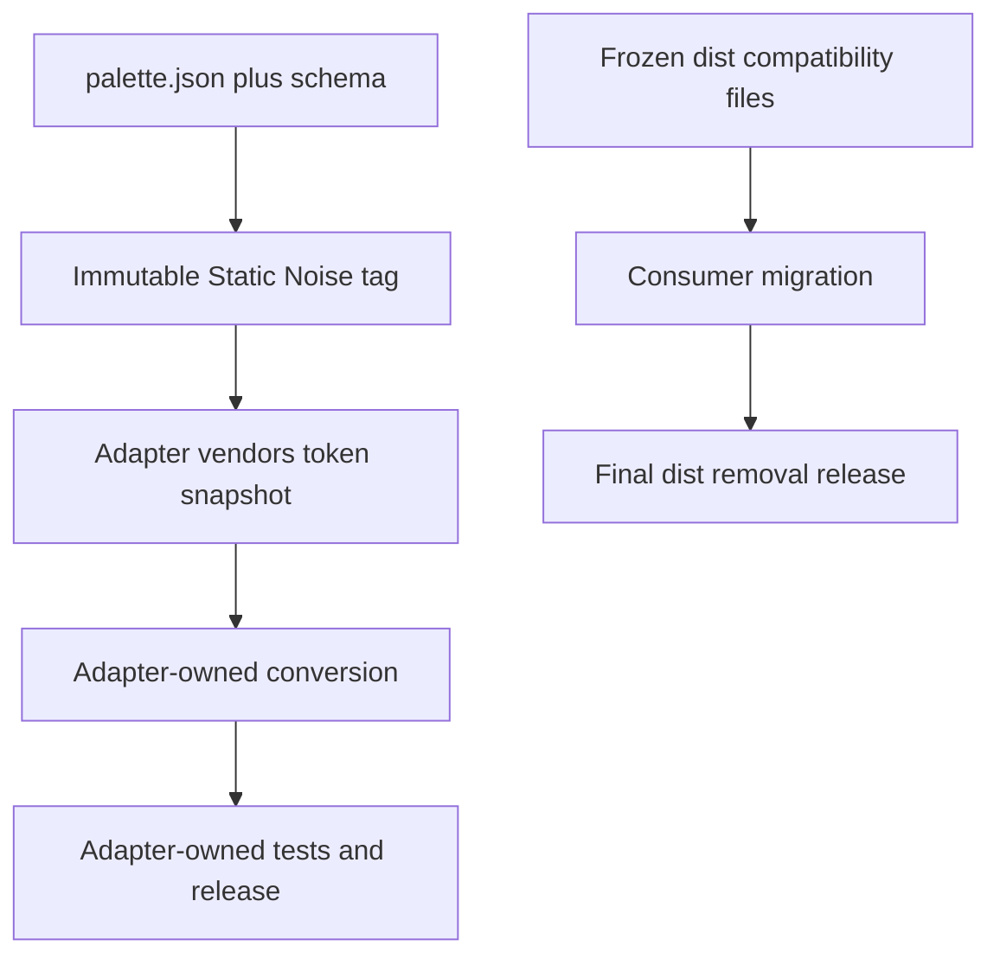

# Token Contract Migration - Plan

## Goal Capsule

- **Objective:** Consumers can adopt Static Noise colors without inheriting tool-specific release cycles, build behavior, or compatibility commitments.
- **Means:** Reduce Static Noise to a versioned token contract and let independent adapters vendor immutable token snapshots. (KTD1, KTD4)
- **Product authority:** `palette.json` and its schema define the public contract; adapters own conversion, compatibility, tests, and releases.
- **Stop conditions:** The repository no longer generates or validates tool configurations, and the retained legacy artifacts are documented as frozen compatibility files rather than supported targets.

---

## Product Contract

### Summary

Static Noise will become a token-only repository with a Git-tagged `palette.json` contract, Vitest validation, and a temporary frozen `dist/` compatibility surface.
It will not add, compile, validate, synchronize, or release adapters.

### Problem Frame

The current repository combines a palette contract with a multi-target compiler, format-specific validators, native tool checks, generated artifacts, and cross-repository dispatch workflows.
That design couples every adapter change to the palette's version and forces Static Noise to track compatibility for tools it should not own.

### Requirements

**Token contract**

- R1. `palette.json` remains the sole canonical token source and is versioned together with its schema and package metadata.
- R2. Static Noise publishes immutable Git tags that adapters can reference to vendor an exact `palette.json` snapshot.
- R3. Static Noise documents token semantics, versioning rules, and the adapter snapshot contract without naming or prescribing individual adapters.

**Core boundaries**

- R4. Static Noise must not generate, transform, validate, dispatch, synchronize, or release tool-specific configurations.
- R5. The repository must not retain a target matrix, per-tool templates, native-tool verification, or tests that assert third-party tool formats.
- R6. The package entry points must expose the token contract rather than a generated artifact.

**Transition and verification**

- R7. Existing `dist/` files remain temporarily as frozen compatibility files; changes to tokens do not regenerate them.
- R8. Documentation must state that adapters own their token snapshot, conversion logic, tests, compatibility policy, and releases.
- R9. Vitest is the sole test runner for the core and tests only the Static Noise contract: schema validity, version consistency, token shape, semantic constraints, and contrast.

### Key Decisions

- **Token-only core.** (session-settled: user-directed — chosen over a central compiler with official adapters: each integration must own its lifecycle). Governs R1–R6 and R8.
- **Git-tagged snapshots.** (session-settled: user-directed — chosen over npm as the contract channel: every ecosystem can vendor an immutable JSON file). Governs R2 and R8.
- **Vitest-only core validation.** (session-settled: user-directed — chosen over `node:test` plus per-tool native checks: core tests should prove Static Noise, not external tools). Governs R5 and R9.
- **Frozen compatibility artifacts.** (session-settled: user-directed — chosen over immediate deletion: existing consumers need a staged migration path). Governs R7.

### Success Criteria

- A clean checkout can validate the token contract with Vitest and no installed third-party tool binaries.
- No source path or CI workflow turns `palette.json` into a tool-specific configuration.
- Public documentation lets an adapter author pin and record an immutable token snapshot without relying on Static Noise internals.
- The only remaining `dist/` content is explicitly labeled frozen and has no build, validation, dispatch, or release path.

### Scope Boundaries

- Includes the Static Noise repository, its package metadata, CI, tests, documentation, and retained legacy files.
- Includes a migration contract that independent adapter repositories can follow.
- Excludes implementation work inside Neovim, VS Code, OhMyConfig, or any future adapter repository.
- Excludes deleting frozen `dist/` files before their consumers have completed separate migrations.

#### Deferred to Follow-Up Work

- Migrate `static-noise.nvim` from its current generated Lua source to a vendored token snapshot.
- Migrate the VS Code consumer to its own snapshot and conversion workflow.
- Migrate OhMyConfig off every retained legacy artifact.
- Create and migrate each remaining adapter repository independently, then remove `dist/` in a final breaking release.

### Acceptance Examples

- AE1. An adapter records a Static Noise tag and commit in its own provenance file, vendors the matching `palette.json`, and derives its local format without a central build command.
- AE2. A malformed token, schema mismatch, version mismatch, invalid hex color, or degraded structural contrast fails the Vitest suite.
- AE3. A token-only release changes the token contract and documentation without triggering an adapter dispatch or requiring Ghostty, Zellij, Neovim, or VS Code binaries.
- AE4. A reader can identify `dist/` as frozen compatibility data and can find the migration rule without treating it as a supported generator output.

---

## Planning Contract

### Key Technical Decisions

- KTD1. **Publish JSON as the stable interface.** Keep `palette.json` at the repository root and define its schema as the compatibility contract. Adapters copy the exact tagged file into their own repository and record the tag and commit in their own provenance document. (session-settled: user-directed — chosen over a central compiler: adapters must remain independent.)
- KTD2. **Make `dist/` read-only compatibility data.** Remove all code paths that write or validate it. Keep its files in place only until each dependent consumer completes an independent migration. (session-settled: user-directed — chosen over immediate deletion: staged migration avoids breaking current consumers.)
- KTD3. **Adopt Vitest for core validation.** Replace Node's built-in runner and all target-format suites with tests that load the contract through the public package interface. (session-settled: user-directed — chosen over `node:test` and native validation: the core owns token correctness only.)
- KTD4. **Release tokens without outbound orchestration.** Delete adapter-dispatch workflows and release documentation that ties a Static Noise tag to consumer artifact changes. Adapter repositories decide when to adopt a tag.

### High-Level Technical Design

### Sequencing

U1 defines the token contract and package surface before tests move to it.
U2 replaces core validation with Vitest and removes target-specific test dependencies.
U3 removes compiler and orchestration behavior while retaining frozen compatibility files.
U4 rewrites public documentation and release policy around independent adapters.
U5 adds a removal gate so legacy data cannot silently become a permanent second contract.

### Risks and Mitigations

- **Stale legacy artifacts:** Mark them frozen in the repository and docs, prohibit regeneration, and list consumer migration as the only path to removal.
- **Adapter drift:** Require each adapter to vendor an immutable tag/commit and maintain provenance in its own repository.
- **Breaking package consumers:** Replace the current generated-artifact entry point with explicit token exports and document the major-version break.
- **Incomplete cleanup:** CI must fail if compiler, template, compatibility, native-verification, or adapter-dispatch paths return after the migration.

### Sources and Research

- `palette.json` and `schemas/` define the current token data and validation surface.
- `src/compiler.mjs`, `src/build.js`, and `src/verify-native.mjs` show the current central compilation and native-verification responsibilities.
- `.github/workflows/dispatch-neovim.yml` and `.github/workflows/dispatch-vscode.yml` implement outbound adapter synchronization that this plan removes.
- `package.json` currently exposes `dist/palette.min.json` and uses `node --test`, both requiring migration.

---

## Implementation Units

### U1. Define the standalone token package

- **Goal:** Make the palette schema and package exports the complete public contract.
- **Requirements:** R1, R2, R3, R6.
- **Dependencies:** None.
- **Files:** `palette.json`, `schemas/palette.schema.json`, `package.json`, `package-lock.json`, `vitest.config.mjs`, `README.md`, `docs/tokens.md`, `docs/versioning.md`, `docs/consumers.md`, `test/token-contract.test.mjs`.
- **Approach:**
  1. Keep the existing root token file and schema as the canonical interface.
  2. Replace generated-artifact package metadata with explicit JSON token exports.
  3. Add Vitest and a minimal contract suite before removing implementation paths that currently read the palette indirectly.
  4. Define semantic-version changes for added, changed, renamed, and removed tokens.
  5. Document the immutable tag-and-commit snapshot workflow without coupling it to any adapter name.
- **Patterns to follow:** Preserve existing token hierarchy and contrast semantics from `palette.json`; do not add tool-specific keys.
- **Test scenarios:**
  1. A valid checked-in palette satisfies the published JSON schema.
  2. Palette and package versions match.
  3. Public package exports resolve to the canonical token file and schema.
  4. An adapter-style copied snapshot remains valid when checked against the published schema.
- **Verification:** Vitest proves the contract can be loaded and validated without `dist/` or any third-party executable.

### U2. Replace core tests with Vitest

- **Goal:** Test Static Noise tokens and semantics without asserting external-tool behavior.
- **Requirements:** R5, R9.
- **Dependencies:** U1.
- **Files:** `test/contrast.test.mjs`, `test/semantic-tokens.test.mjs`, `test/build.test.mjs` (delete), `test/compiler.test.mjs` (delete), `test/validation.test.mjs` (delete), `test/targets/` (delete), `src/verify-native.mjs` (delete), `compatibility.json` (delete).
- **Approach:**
  1. Extend the U1 Vitest suite with six-digit color encoding, required semantic roles, retired-token absence, and contrast thresholds.
  2. Delete compiler, target, compatibility, and native-validation test suites instead of translating their expectations into core tests.
  3. Ensure test fixtures are token-only JSON inputs.
- **Execution note:** Start with failing Vitest coverage for the retained token invariants, then remove obsolete suites.
- **Patterns to follow:** Preserve the existing contrast calculations as token-domain logic, not as a rendering utility.
- **Test scenarios:**
  1. Missing required token groups fail schema and semantic validation.
  2. Invalid or non-canonical hex values fail token validation.
  3. `borderStrong` satisfies the documented contrast threshold against `void`.
  4. Reintroducing retired `borderFocus` fails the semantic-token suite.
  5. The suite runs with no Ghostty, Zellij, Neovim, VS Code, Fish, or other target binary available.
- **Verification:** `npm test` runs Vitest only and reports core contract failures with the affected token named.

### U3. Remove central compilation and adapter orchestration

- **Goal:** Delete all active paths through which Static Noise owns tool-specific outputs.
- **Requirements:** R4, R5, R7.
- **Dependencies:** U1, U2.
- **Files:** `src/build.js` (delete), `src/compiler.mjs` (delete), `src/kdl.mjs` (delete), `src/validate.mjs` (delete), `templates/` (delete), `.github/workflows/dispatch-neovim.yml` (delete), `.github/workflows/dispatch-vscode.yml` (delete), `.github/workflows/verify.yml`, `dist/`.
- **Approach:**
  1. Remove the compiler, template renderer, format parsers, and target validators.
  2. Delete outbound synchronization workflows so tags have no adapter side effects.
  3. Replace CI with token-package installation and Vitest validation only.
  4. Retain the existing `dist/` tree unchanged; U5 adds its frozen-compatibility notice.
- **Execution note:** Treat the checked-in legacy files as read-only migration input; any change to them is a scope violation until its consumer owns the artifact.
- **Patterns to follow:** Keep deletion focused on central target behavior; do not recreate a target registry under another name.
- **Test scenarios:**
  1. CI has no command that invokes a compiler, renderer, native verifier, or target-specific parser.
  2. A repository search finds no active template registry, compatibility matrix, or adapter dispatch workflow.
  3. Legacy `dist/` files remain byte-for-byte unchanged by the core test workflow.
- **Verification:** The repository passes Vitest and CI validates only the token package while retained files have no write path.

### U4. Publish the independent-adapter contract

- **Goal:** Make the ownership boundary understandable to contributors and future adapter maintainers.
- **Requirements:** R2, R3, R8.
- **Dependencies:** U1, U3.
- **Files:** `README.md`, `docs/tokens.md`, `docs/versioning.md`, `docs/consumers.md`, `RELEASING.md`, `AGENTS.md`.
- **Approach:**
  1. Reframe the project as a token contract rather than a theme compiler.
  2. Document tag-based snapshot adoption, provenance requirements, and adapter-owned release responsibilities.
  3. Remove references to generated targets, native verification, target compatibility, and dispatch secrets.
  4. Update contributor guidance so token changes never include adapter logic or legacy artifact regeneration.
- **Patterns to follow:** Keep semantic token documentation as the source of color-role meaning.
- **Test expectation:** none -- documentation and contributor-policy work is verified through consistency review.
- **Verification:** Documentation contains one contract model and no claim that Static Noise supports or releases a tool integration.

### U5. Define the final legacy-removal gate

- **Goal:** Prevent frozen compatibility files from becoming an undeclared permanent API.
- **Requirements:** R7, R8.
- **Dependencies:** U3, U4.
- **Files:** `docs/versioning.md`, `docs/consumers.md`, `README.md`, `dist/README.md` (new).
- **Approach:**
  1. State that each consumer migration is completed in its own repository and records its own token snapshot provenance.
  2. Define the final removal condition: no maintained consumer reads a legacy artifact and each relevant adapter has released its independent snapshot flow.
  3. Mark legacy artifacts as frozen, unsupported for new features, and removable only in the next scheduled breaking release after that condition is met.
- **Patterns to follow:** Treat consumer migration as external dependency management, not a new responsibility of Static Noise.
- **Test scenarios:**
  1. The legacy notice names the frozen status and points to the generic adapter contract without embedding adapter-specific instructions.
  2. Versioning documentation distinguishes token changes from adapter releases and legacy-file removal.
- **Verification:** A reviewer can determine when `dist/` may be removed without relying on hidden build behavior or CI state.

---

## Verification Contract

| Scope | Proof |
| --- | --- |
| Token contract | Vitest validates schema, version parity, semantic roles, color format, and contrast. |
| Package surface | Vitest resolves the documented JSON exports from a clean checkout. |
| Core boundary | Repository checks confirm compiler, templates, target suites, compatibility matrix, native verifier, and dispatch workflows are absent. |
| Legacy compatibility | A before/after checksum confirms retained `dist/` content was not rewritten during this migration. |
| Documentation | Review confirms release and contributor docs describe tag snapshots and adapter-owned responsibilities only. |

---

## Definition of Done

- U1–U5 are complete and their specified verification conditions hold.
- `npm test` runs Vitest without requiring any target-specific binary.
- Static Noise exposes a stable token contract and no active adapter implementation path.
- `dist/` is clearly frozen, has no generator or validator, and has a documented final-removal gate.
- No abandoned compiler, target validator, dispatch workflow, or obsolete documentation remains in the diff.
