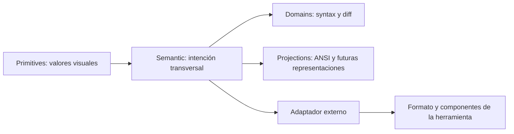

# Semantic Token System - Plan

## Goal Capsule

- **Objective:** Static Noise tendrá un contrato de tokens pequeño, coherente y legible para personas y agentes, capaz de comunicar la identidad visual del tema y guiar adaptadores sin depender de nombres de herramientas.
- **Means:** Adoptar DTCG como estructura técnica, usar roles semánticos inspirados en Material 3 y mantener una taxonomía mínima propia para sintaxis y diff.
- **Authority:** `palette.json` define los valores y roles públicos; `docs/tokens.md` y `docs/consumers.md` explican su intención y uso.
- **Stop conditions:** No se añadirán tokens de componentes o herramientas; la documentación debe permitir crear un adaptador sin leer código interno ni adivinar el significado de un color.

---

## Product Contract

### Summary

Static Noise evolucionará de una colección de grupos cromáticos a un contrato semántico mínimo para una identidad visual de desarrollo.
La estructura distinguirá valores base, roles visuales transversales y dominios propios de herramientas de desarrollo, mientras la documentación servirá como guía normativa para humanos y agentes de IA.

### Problem Frame

La paleta actual contiene colores útiles, pero mezcla valores base, intención visual, sintaxis, estados y proyecciones ANSI en una misma estructura. Un adaptador puede consumirla, pero debe deducir si un token expresa identidad, estado o una necesidad específica de una herramienta.

Los sistemas consolidados como Material 3, Carbon y USWDS separan valores de roles semánticos. DTCG ofrece una representación interoperable con tipos, descripciones y aliases, pero no impone una taxonomía. Static Noise necesita tomar esos principios sin adoptar la escala de un sistema de componentes.

### Requirements

**Contrato visual**

- R1. El contrato separará primitives (valores base) de roles semánticos, dominios de desarrollo y proyecciones de compatibilidad.
- R2. Los roles centrales usarán nombres de intención visual, no nombres de herramientas ni componentes.
- R3. La taxonomía semántica será mínima: superficies, contenido, outline, interacción y estados.
- R4. `syntax` y `diff` serán dominios explícitos de desarrollo, no componentes de una herramienta.
- R5. Los pares foreground/background se definirán mediante roles `onX` solo cuando un fondo semántico requiera contraste explícito.
- R6. No se añadirán tokens de botones, barras, paneles, editores, plugins o herramientas concretas al contrato central.

**Documentación**

- R7. La documentación explicará el propósito de Static Noise, su identidad visual, el modelo de profundidad y la intención de cada familia de tokens.
- R8. La documentación incluirá reglas de uso, anti-patrones, criterios para proponer tokens nuevos y ejemplos de mapeo a un adaptador.
- R9. La guía será explícita para agentes de IA: deberá indicar cómo razonar sobre un token, cómo preservar semántica y cuándo no inventar colores.
- R10. El schema y la suite de contrato validarán la estructura, tipos, aliases y metadatos esenciales del contrato.

**Verificación**

- R11. Los tests validarán estructura, referencias, descripciones obligatorias, formato de color y contraste de pares documentados.
- R12. El contrato central no contendrá nombres específicos de herramientas ni componentes; la documentación puede mencionarlos únicamente como ejemplos de adaptadores.

### Key Decisions

- **DTCG como formato técnico.** (session-settled: user-approved — elegido frente a un formato propietario: permite tipos, aliases y metadatos interoperables).
- **Material 3 como principio semántico, no como taxonomía completa.** (session-settled: user-approved — elegido frente a copiar todos sus tokens: Static Noise no es un sistema de componentes).
- **Taxonomía central mínima.** (session-settled: user-approved — elegido frente a roles por componente: la identidad debe permanecer independiente de las herramientas).

### Success Criteria

- Un lector puede explicar qué distingue visualmente a Static Noise después de leer el README y la guía de tokens.
- Un agente de IA puede seleccionar un token existente para un adaptador sin deducir su significado por el nombre del color.
- Un adaptador puede identificar qué debe consumir, qué debe derivar localmente y qué no debe agregar al núcleo.
- Cada alias y token semántico tiene una descripción normativa y una prueba de integridad.

### Scope Boundaries

- Incluye la reorganización de `palette.json`, su schema, tests y documentación pública.
- Incluye una guía de consumo orientada a autores humanos y agentes de IA.
- Excluye implementaciones dentro de `static-noise.nvim`, VS Code, OhMyConfig o cualquier otro adaptador.
- Excluye tokens de componentes y configuraciones específicas de herramientas.
- Excluye rediseñar colores sin evidencia de que un valor no pueda cumplir su rol actual.

#### Deferred to Follow-Up Work

- Migrar `static-noise.nvim` al nuevo contrato.
- Crear snapshots y conversores propios para adaptadores independientes.
- Revisar contraste específico de cada herramienta dentro de sus adaptadores.

### Acceptance Examples

- AE1. `palette.json` distingue valores base, roles semánticos, dominios `syntax`/`diff` y la proyección `ansi` sin nombres de componentes.
- AE2. Un alias semántico apunta a un valor base válido, conserva su tipo y contiene una descripción de intención.
- AE3. Una solicitud para colorear una powerbar se resuelve en el adaptador mediante roles de superficie, contenido, outline e interacción, sin agregar un token `powerbar` al núcleo.
- AE4. Una guía de IA explica qué hacer cuando la herramienta no soporta un rol y prohíbe sustituirlo silenciosamente por un color arbitrario.
- AE5. Un token mal formado, una referencia inexistente, una descripción ausente o un par `onX` con contraste insuficiente falla la suite.

---

## Planning Contract

### Key Technical Decisions

- KTD1. **Usar cuatro capas: primitives, semantic, domains y projections.** Las primitives contienen valores visuales; semantic contiene intención transversal; domains contiene conceptos de desarrollo como syntax y diff; projections contiene formatos de compatibilidad como ANSI. (session-settled: user-approved — elegido frente a una lista plana: reduce ambigüedad sin crear un sistema de componentes.)
- KTD2. **Mantener dominios `syntax` y `diff` como extensiones de identidad.** Son conceptos comunes en herramientas de desarrollo y no dependen de una marca o producto concreto.
- KTD3. **Usar aliases DTCG y descripciones como contrato legible.** Los aliases evitan duplicar hexadecimales y las descripciones sirven tanto a humanos como a agentes.
- KTD5. **Tratar `onX` como un patrón opcional.** Solo se añadirá un par `onX` cuando exista un fondo semántico estable que necesite declarar explícitamente su contenido y contraste; no se crearán pares para cada color de identidad por simetría.
- KTD4. **Mantener la migración incompatible contenida.** El cambio de estructura se versiona como contrato; los adaptadores no se modifican dentro de este plan y adoptarán la nueva versión por separado.

### High-Level Technical Design

La dirección de dependencia es unidireccional: los adaptadores pueden derivar tokens locales desde `semantic`, pero Static Noise no recibe nombres ni decisiones de esos adaptadores.

### Documentation Design

La documentación se organizará en cuatro preguntas:

1. **Qué es Static Noise:** propósito, audiencia e identidad visual.
2. **Qué significa cada token:** profundidad, contenido, interacción, estado, sintaxis y diff.
3. **Cómo se consume:** snapshot, aliases, procedencia y adaptación.
4. **Cómo decidir:** reglas para agentes, anti-patrones y criterios para proponer cambios al contrato.

### Risks and Mitigations

- **Sobre-modelado:** limitar el contrato a roles transversales y rechazar tokens de componentes.
- **Aliases opacos:** exigir `$description`, referencias válidas y ejemplos de uso.
- **Ruptura para adaptadores existentes:** tratar la nueva estructura como un cambio de contrato y dejar la migración de adaptadores fuera de este plan.
- **Contraste incompleto:** validar pares `onX` y documentar cuándo un adaptador debe realizar pruebas adicionales.
- **Documentación decorativa:** añadir escenarios concretos y anti-patrones que puedan verificarse durante revisión.

### Sources and Research

- [DTCG Design Tokens Format 2025.10](https://www.w3.org/community/reports/design-tokens/CG-FINAL-format-20251028/) — formato, tipos, aliases y metadatos.
- [Material 3 Color Roles](https://m3.material.io/styles/color/roles) — roles semánticos, superficies tonales y pares `onX`.
- [USWDS Theme Tokens](https://designsystem.digital.gov/design-tokens/color/theme-tokens/) — separación entre tokens de sistema y tokens de tema.
- [USWDS State Tokens](https://designsystem.digital.gov/design-tokens/color/state-tokens/) — agrupación de estados semánticos.
- [Carbon Color](https://carbondesignsystem.com/elements/color/overview/) — roles estables e independencia entre tema y componentes.
- `palette.json`, `docs/tokens.md`, `docs/consumers.md` — contrato e identidad actuales que serán refinados.

---

## Implementation Units

### U1. Redefinir el contrato de tokens

- **Goal:** Reorganizar `palette.json` en primitives, semantic, domains y projections sin introducir nombres de herramientas.
- **Requirements:** R1–R6, R10.
- **Dependencies:** None.
- **Files:** `palette.json`, `schemas/palette.schema.json`, `package.json`.
- **Approach:**
  1. Separar valores neutrales, texto y acentos como primitives.
  2. Crear roles semánticos mínimos para superficies, contenido, outline, interacción y estados.
  3. Mantener `syntax`, `diff` y `ansi` como dominios/proyecciones con límites claros.
  4. Representar aliases con formato DTCG y descripciones.
- **Execution note:** Definir primero la estructura del schema y los ejemplos DTCG; después migrar la paleta y finalmente implementar la cobertura en U4.
- **Verification:** El contrato y el schema quedan listos para que U4 valide estructura, aliases y referencias.

### U2. Reescribir la guía de identidad visual

- **Goal:** Hacer que la identidad y el propósito de los tokens sean entendibles sin leer código.
- **Requirements:** R7, R8, R12; AE1, AE3.
- **Dependencies:** U1.
- **Files:** `README.md`, `docs/tokens.md`, `docs/palette-preview.svg`.
- **Approach:**
  1. Explicar el propósito del tema y sus principios visuales.
  2. Documentar primitives, semantic, domains y projections con ejemplos.
  3. Explicar profundidad, foco, estructura, contenido y estados.
  4. Mostrar qué tokens se combinan y cuáles no deben confundirse.
- **Test expectation:** none -- documentation is verified by consistency review against the new contract and token descriptions.
- **Verification:** El README y la guía no contienen roles obsoletos ni referencias a adaptadores como parte del núcleo.

### U3. Crear guía de adaptación para humanos y agentes

- **Goal:** Permitir que un autor construya un adaptador sin inventar semántica ni colores.
- **Requirements:** R8, R9, R12; AE3, AE4.
- **Dependencies:** U1, U2.
- **Files:** `docs/consumers.md`, `AGENTS.md`.
- **Approach:**
  1. Explicar cómo fijar un tag y snapshot de tokens.
  2. Definir cómo mapear roles semánticos a capacidades de una herramienta.
  3. Añadir reglas para capacidades ausentes, tokens nuevos y decisiones locales.
  4. Añadir anti-patrones y un ejemplo genérico de razonamiento de adaptación.
- **Test expectation:** none -- the guide is a human/agent contract verified by documentation review.
- **Verification:** Un agente puede identificar qué consumir, qué derivar localmente y cuándo proponer un cambio al contrato.

### U4. Fortalecer la suite de contrato

- **Goal:** Probar que la estructura semántica documentada no se degrada con cambios futuros.
- **Requirements:** R10, R11; AE2, AE5.
- **Dependencies:** U1.
- **Files:** `test/schema.test.mjs`, `test/semantics.test.mjs`, `test/accessibility.test.mjs`, `test/helpers/palette.mjs`.
- **Approach:**
  1. Mantener cada archivo enfocado en una sola responsabilidad y comenzar cada suite con una descripción de su propósito.
  2. `schema.test.mjs` valida estructura DTCG, capas públicas, tipos y referencias internas.
  3. `semantics.test.mjs` valida descripciones, roles obligatorios y ausencia de nombres de herramientas o componentes.
  4. `accessibility.test.mjs` valida contraste de pares explícitos y roles estructurales.
  5. Mantener helpers pequeños y reutilizables, sin convertirlos en una segunda implementación del contrato.
- **Test scenarios:**
  1. Una referencia a un token inexistente falla con la ruta del alias en `schema.test.mjs`.
  2. Una descripción ausente o vacía falla en `semantics.test.mjs`.
  3. Un color inválido falla aunque esté dentro de una capa anidada en `schema.test.mjs`.
  4. Un nombre de componente o herramienta falla en `semantics.test.mjs`.
  5. Un par `onX` con contraste insuficiente falla en `accessibility.test.mjs`.
  6. Una paleta válida conserva la estructura esperada en todas las suites.
- **Verification:** `npm test` ejecuta suites pequeñas, descriptivas y enfocadas sin depender de herramientas externas.

---

## Verification Contract

| Scope | Proof |
| --- | --- |
| Contract shape | Vitest valida capas, roles, aliases, tipos y referencias. |
| Visual identity | README y `docs/tokens.md` describen propósito, principios y usos sin nombres de herramientas. |
| Adapter guidance | `docs/consumers.md` contiene flujo, límites y anti-patrones verificables. |
| Accessibility | Los pares foreground/background declarados cumplen el umbral definido por el contrato. |
| Repository quality | No aparecen tokens de componentes o herramientas en `palette.json` ni en el schema. |

---

## Definition of Done

- El contrato distingue primitives, semantic, domains y projections.
- La taxonomía central no contiene nombres de herramientas ni componentes.
- Cada token público tiene una intención documentada.
- La guía permite a una persona o agente crear un adaptador sin adivinar el significado visual.
- Vitest pasa validando estructura, aliases, tipos, descripciones y contraste.
- La documentación pública refleja el contrato final y no conserva la estructura anterior.
- Las suites de tests están divididas por responsabilidad, tienen nombres descriptivos y documentan explícitamente su propósito.
- No quedan cambios experimentales ni documentación obsoleta.
