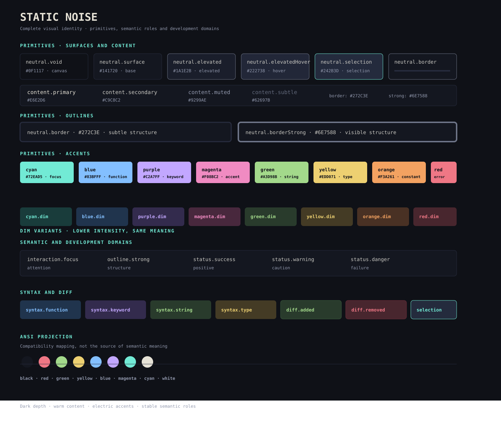

# Static Noise

Static Noise es una identidad visual cromática para herramientas de desarrollo.

Fue creada para resolver un problema concreto: los entornos de terminal y los editores suelen acumular fondos negros, grises y acentos saturados sin una jerarquía común. Static Noise propone una superficie oscura, cálida y profunda, con acentos eléctricos de baja fatiga visual y suficiente contraste para distinguir estructura, foco, sintaxis y estados.

El proyecto publica un contrato de tokens. No genera configuraciones para herramientas concretas. Cada adaptador consume una versión de `palette.json` y decide cómo representar esa identidad dentro de sus propias capacidades.



## Identidad visual

Static Noise se basa en cinco principios:

1. **Profundidad sin negro absoluto.** El lienzo parte de `void` y construye superficies progresivas con `surface` y `card`, evitando que toda la interfaz se convierta en una sola masa negra.
2. **Foco eléctrico.** `cyan` identifica el cursor, el foco activo y la interacción principal. Es un color de atención, no un relleno decorativo permanente.
3. **Jerarquía cálida.** El texto principal usa blancos cálidos para reducir la dureza de los fondos fríos y conservar legibilidad prolongada.
4. **Semántica estable.** Los acentos tienen funciones consistentes: azul para funciones, púrpura para keywords, verde para strings, amarillo para tipos, naranja para constantes y rojo para errores.
5. **Estructura neutral.** Los bordes y separadores delimitan la interfaz sin competir con el foco. `borderStrong` está reservado para límites estructurales que deben seguir visibles en fondos oscuros o transparentes.

La paleta está pensada para personas que pasan muchas horas alternando entre terminales, editores, multiplexores, herramientas Git y asistentes de desarrollo. Su objetivo no es maximizar el número de colores, sino hacer que cada color comunique algo distinto.

## Contrato de tokens

- `palette.json` es la fuente canónica.
- `schemas/palette.schema.json` define la estructura válida.
- `docs/tokens.md` explica la identidad, los roles y las reglas de uso.
- `docs/consumers.md` explica snapshots y responsabilidades de los consumidores.
- `docs/adapter-authoring.md` guía el mapeo semántico para autores y agentes de IA.
- `RELEASING.md` define versionado y publicación.

## Uso de los colores

Los adaptadores deben mapear los tokens por intención, no por coincidencia superficial de nombres:

| Necesidad visual | Token recomendado |
| --- | --- |
| Necesidad visual | Token recomendado |
| --- | --- |
| Lienzo o fondo raíz | `semantic.surface.canvas` |
| Superficie principal | `semantic.surface.base` |
| Panel o contenedor elevado | `semantic.surface.elevated` |
| Separador sutil | `semantic.outline.subtle` |
| Límite estructural | `semantic.outline.strong` |
| Cursor o elemento enfocado | `semantic.interaction.focus` |
| Texto principal | `semantic.content.primary` |
| Texto secundario | `semantic.content.secondary` o `semantic.content.muted` |
| Funciones y métodos | `domains.syntax.function` |
| Keywords y modificadores | `domains.syntax.keyword` |
| Strings y literales | `domains.syntax.string` |
| Tipos e interfaces | `domains.syntax.type` |
| Constantes y números | `domains.syntax.constant` |
| Errores y eliminaciones | `domains.syntax.error` o `domains.diff.removed` |

Los adaptadores deben consumir primero `semantic` y `domains`. `primitives` sirve para referencias internas y `projections` solo para compatibilidad. No se deben introducir colores arbitrarios dentro de un adaptador para resolver una diferencia visual local; primero hay que decidir si la necesidad pertenece al contrato común o únicamente a la herramienta.

## Desarrollo

```bash
npm test
```

La suite usa Vitest y valida únicamente el contrato de Static Noise: estructura, roles, versiones, formato hexadecimal y contraste. No requiere Ghostty, Zellij, Neovim, VS Code ni otros binarios externos.

## Licencia

Publicado bajo la licencia MIT. Libre para uso personal, distribución y modificaciones.
