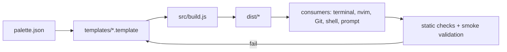

# Harmonize Static Noise Theme Targets - Plan

## Goal Capsule

- **Objective:** Todas las herramientas generadas presentan una identidad visual coherente y predecible, sin colores externos al tema ni asignaciones semánticas contradictorias.
- **Means:** Ajustar las plantillas para consumir únicamente tokens de `palette.json`, completar estados visuales faltantes y eliminar herencia de colores del entorno (KTD1, KTD2).
- **Authority:** `palette.json` define los colores; la semántica documentada del proyecto define su uso; las plantillas definen la representación por herramienta; `dist/` es derivado.
- **Stop conditions:** No añadir hexadecimales fuera de `palette.json`, no editar `dist/` como fuente primaria y no modificar la semántica de la paleta sin una decisión separada.
- **Finisher:** El implementador debe completar las plantillas, regenerar artefactos y validar los targets afectados.

---

## Product Contract

### Summary

El sistema debe ofrecer una armonía visual única entre terminal, multiplexor, shell, prompt, herramientas Git, monitor de sistema, editor y agente interactivo.

### Problem Frame

Las plantillas consumen la paleta, pero algunos targets heredan colores externos, omiten estados visuales o asignan tokens con una semántica diferente. Esto hace que herramientas del mismo ecosistema parezcan temas distintos.

### Requirements

**Fuente única y restricciones**

- R1. Todos los colores concretos de las plantillas deben resolverse desde `palette.json`; no se introducirán hexadecimales nuevos en `templates/`.
- R2. Los artefactos de `dist/` deben regenerarse desde las plantillas y no modificarse manualmente.

**Semántica compartida**

- R3. Las herramientas deben conservar la semántica canónica: cyan para foco/interacción, blue para funciones/información, purple para keywords/modificadores, green para strings/éxito, yellow para tipos/advertencias, orange para constantes/números, red para errores/eliminados y magenta para acentos especiales.
- R4. Los tokens dim deben utilizarse como fondos de estado, selección o diff cuando corresponda, sin reemplazar indiscriminadamente los fondos base ni los textos legibles.

**Targets y estados**

- R5. LazyGit, Zellij, Pi, Fish/FZF, Delta, Bottom, Starship, VS Code y nvim deben cubrir los estados que sus plantillas exponen usando los tokens compartidos, sin exigir paridad de campos entre herramientas con capacidades distintas.
- R6. Ningún target debe depender de valores heredados del terminal cuando la plantilla controle explícitamente ese aspecto visual.

### Scope Boundaries

- Incluye las plantillas existentes y sus artefactos generados.
- Incluye correcciones de asignación semántica, cobertura de estados y contraste mediante tokens existentes.
- No incluye rediseñar la paleta ni añadir colores nuevos.
- No incluye cambiar workflows de release ni configuraciones de consumidores externos.

### Success Criteria

- Cada placeholder de color de las plantillas apunta a un token existente de `palette.json`.
- Las asignaciones de keywords, tipos, funciones, strings, estados y diffs son semánticamente equivalentes entre targets comparables.
- Zellij no introduce colores heredados en segmentos controlados por la plantilla.
- LazyGit cubre los estados relevantes sin recurrir a sus colores predeterminados.
- La compilación produce artefactos válidos y reproducibles.

---

## Planning Contract

### Key Technical Decisions

- KTD1. `palette.json` permanece como única fuente cromática; se descarta la alternativa de definir colores locales por target porque produciría divergencia y duplicación.
- KTD2. Las plantillas usarán referencias de tokens, no valores hexadecimales ni aliases cromáticos nuevos; los aliases existentes solo pueden mapear a tokens ya definidos.
- KTD3. La semántica de VS Code y la documentación de `palette.json` serán la referencia para alinear Pi, Fish y nvim; Starship conservará una semántica contextual por módulo porque no representa sintaxis.
- KTD4. Los fondos explícitos reemplazarán herencias `default` en Zellij cuando el componente sea parte del layout Static Noise; la herencia solo se conservará donde sea necesaria para la integración del terminal.
- KTD5. La cobertura se validará en plantillas y artefactos generados, con pruebas estáticas y smoke checks por herramienta en lugar de una suite de runtime inexistente.

### High-Level Technical Design

El flujo debe preservar la jerarquía `void → surface → card → cardHover`, utilizar `cyan` como foco común y reservar acentos restantes para semántica. Los fondos dim deben acompañar estados sin convertirse en foregrounds de bajo contraste.

### System-Wide Impact

El cambio afecta simultáneamente a consumidores con sintaxis distinta: TOML, YAML, KDL, Fish, Lua y JSON. La fuente compartida reduce divergencias, pero cada formato necesita validación sintáctica propia y LazyGit/Zellij requieren revisar interacción entre segmentos y fondos.

### Risks & Dependencies

- Las opciones exactas de LazyGit, zjstatus y Delta dependen de las versiones instaladas; validar contra documentación oficial y evitar campos no soportados por el esquema usado por el proyecto.
- Sustituir `default` en Zellij puede afectar transparencia o composición con el terminal; revisar cada reset y conservar solo los que sean necesarios para no arrastrar estilo entre segmentos.
- Completar LazyGit puede cambiar la lectura visual de estados existentes; mantener cyan para foco y no reutilizarlo como estado permanente.

### Sources / Research

- `palette.json` y `AGENTS.md`: fuente cromática, semántica y flujo de compilación.
- `templates/vscode.json.template`: referencia más completa para semántica de sintaxis y estados de editor.
- `templates/neovim.lua.template`: grupos visuales compartidos, Treesitter, LSP y Powerline.
- Documentación oficial de LazyGit, zjstatus y git-delta consultada para confirmar campos de tema, directivas de formato y estilos de diff.

---

## Implementation Units

### U1. Normalizar semántica compartida en shells y Pi

- **Goal:** Alinear Pi y Fish/FZF con la semántica canónica sin cambiar la paleta.
- **Requirements:** R1, R3, R4, R5.
- **Dependencies:** Ninguna.
- **Files:** `templates/pi-theme.json.template`, `templates/fish-colors.template`, `dist/pi/static-noise-theme.json`, `dist/fish/static-noise-colors.fish`.
- **Approach:** Corregir aliases de keywords y tipos en Pi; revisar keywords y fondos de selección en Fish/FZF; conservar colores contextuales que no representen sintaxis.
- **Test scenarios:**
  - Un keyword y un tipo usan respectivamente purple y yellow en el target Pi generado.
  - Un keyword de Fish usa purple y la selección mantiene un fondo dim con texto legible.
  - No aparecen hexadecimales fuera de `palette.json` en las plantillas modificadas.
- **Verification:** Los targets generados coinciden con la semántica de VS Code y nvim para conceptos equivalentes.

### U2. Completar y estabilizar LazyGit

- **Goal:** Cubrir los estados visuales relevantes de LazyGit con tokens del tema.
- **Requirements:** R1, R3, R4, R5, R6.
- **Dependencies:** Ninguna.
- **Files:** `templates/lazygit-theme.template`, `dist/lazygit/static-noise-theme.yml`.
- **Approach:** Extender `gui.theme` solo con campos soportados por LazyGit; asignar fondos base/dim a estados y acentos brillantes a foco o semántica; coordinar colores de selección, cambios, conflictos, ramas y commits con Delta.
- **Test scenarios:**
  - La línea seleccionada usa un fondo dim y permanece distinguible del borde activo.
  - Estados staged, modificados, eliminados y conflicted tienen colores semánticos distintos y derivados de la paleta.
  - La búsqueda activa conserva el contraste frente a la selección y el fondo del panel.
  - El YAML generado es válido y no contiene colores literales fuera de los valores renderizados desde la paleta.
- **Verification:** Un repositorio con cambios staged, unstaged, eliminados y conflictos se visualiza sin recurrir a colores predeterminados para los estados configurados.

### U3. Unificar layout y segmentos de Zellij

- **Goal:** Hacer que la barra, tabs y modos de Zellij mantengan fondos y separadores dentro de Static Noise.
- **Requirements:** R1, R3, R4, R6.
- **Dependencies:** U2.
- **Files:** `templates/zellij.kdl.template`, `templates/zellij-layout.kdl.template`, `dist/zellij/static-noise.kdl`, `dist/zellij/layouts/default.kdl`.
- **Approach:** Sustituir resets `default` controlables por tokens explícitos; establecer una convención de segmentos basada en `void`, `card`, `cardHover` y acentos; preservar resets únicamente cuando sean necesarios para zjstatus.
- **Test scenarios:**
  - Cada modo de Zellij conserva contraste entre etiqueta activa y texto de ayuda.
  - Tabs normales, activas y estados especiales mantienen una transición consistente entre fondos.
  - La barra no hereda accidentalmente el foreground/background del terminal en sus segmentos controlados.
  - Los archivos KDL generados conservan sintaxis válida y no contienen placeholders.
- **Verification:** Todos los modos y estados de tabs se leen con la misma jerarquía de superficies y foco que nvim y LazyGit.

### U4. Ajustar Delta y Bottom sin ampliar la paleta

- **Goal:** Mejorar la lectura de diffs y gráficos secundarios mediante la selección correcta de tokens existentes.
- **Requirements:** R1, R3, R4, R5.
- **Dependencies:** Ninguna.
- **Files:** `templates/delta-theme.template`, `templates/bottom-colors.template`, `dist/delta/static-noise.gitconfig`, `dist/bottom/static-noise-colors.toml`.
- **Approach:** Mantener `colors.diff.*` como autoridad para fondos de diff; revisar foregrounds de líneas y énfasis; usar muted en gráficos solo si dim resulta ilegible, sin crear variantes nuevas.
- **Test scenarios:**
  - Líneas añadidas y eliminadas conservan fondos verdes/rojos dim y números de línea semánticos.
  - El énfasis de palabra se distingue del fondo de línea sin perder legibilidad.
  - Gráficos y valores seleccionados de Bottom se distinguen del fondo y entre sí.
  - TOML/configuración generada conserva sintaxis válida.
- **Verification:** Delta y Bottom expresan estados de cambio, selección y recursos sin competir con el foco principal cyan.

### U5. Auditoría transversal y artefactos

- **Goal:** Garantizar que todos los targets se generan de forma reproducible y no contienen divergencias cromáticas accidentales.
- **Requirements:** R1, R2, R3, R5, R6.
- **Dependencies:** U1, U2, U3, U4.
- **Files:** `src/build.js` solo si hace falta una validación nueva, `templates/`, `dist/`, `README.md` solo si la semántica pública cambia.
- **Approach:** Revisar primero la salida completa de cada plantilla; añadir validaciones al compilador solo para invariantes que actualmente no cubre; regenerar todos los targets y comparar los artefactos; documentar cambios semánticos públicos.
- **Test scenarios:**
  - La compilación completa produce todos los artefactos esperados sin placeholders.
  - JSON, YAML, TOML, KDL y Lua generados pasan sus validaciones disponibles.
  - Una segunda compilación sin cambios no altera `dist/`.
  - La búsqueda de hexadecimales en `templates/` devuelve únicamente referencias de placeholders, no colores literales.
- **Verification:** El repositorio queda con fuente, plantillas y artefactos sincronizados, sin colores fuera de la paleta ni herencias visuales no justificadas.

---

## Verification Contract

- La compilación completa debe finalizar correctamente mediante el script oficial del proyecto.
- Los artefactos generados deben quedar sincronizados con sus plantillas y `palette.json`.
- Debe ejecutarse una revisión estática de placeholders sin resolver y colores hexadecimales fuera de la fuente.
- Debe validarse la sintaxis de cada formato generado por el compilador o por smoke checks disponibles.
- La revisión visual debe cubrir LazyGit, Zellij, Delta, Bottom, Fish/FZF, Pi y nvim en sus estados principales.

## Definition of Done

- Todas las plantillas modificadas consumen tokens existentes de `palette.json`.
- No se agregan colores hardcodeados fuera de `palette.json`.
- Las asignaciones semánticas entre targets equivalentes están alineadas.
- LazyGit y Zellij no dependen de colores heredados en las áreas controladas por sus plantillas.
- Todos los archivos de `dist/` fueron regenerados y están sincronizados.
- La documentación se actualiza si cambia una semántica pública.
- Se eliminan restos de experimentos o configuraciones abandonadas antes de cerrar el trabajo.
